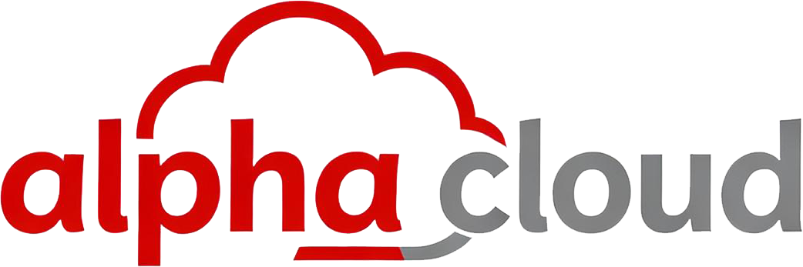
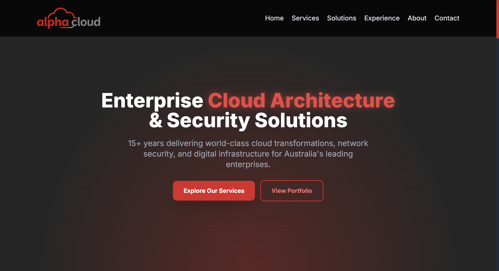
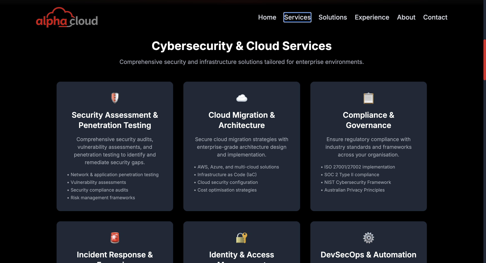
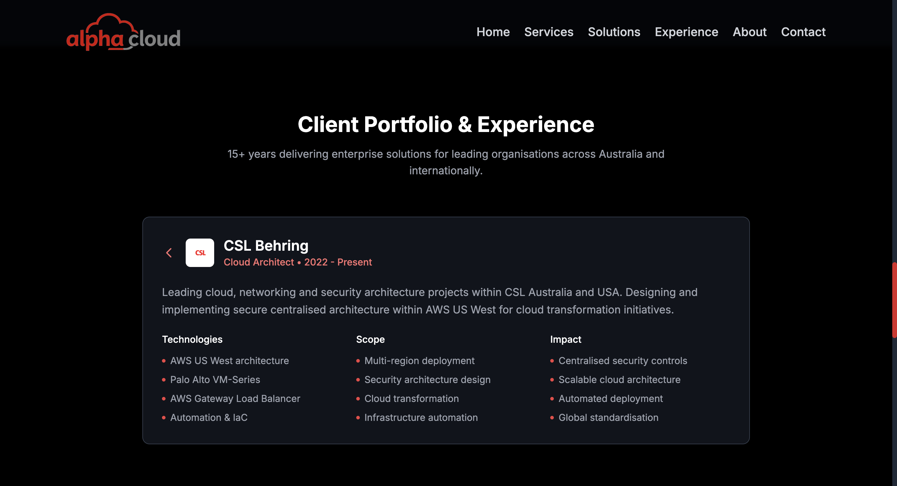
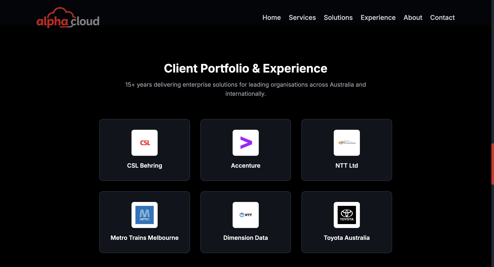

# Alpha Cloud - Enterprise Cloud Security Solutions

> Professional portfolio website for Alpha Cloud PTY LTD, showcasing 15+ years of enterprise cloud architecture and cybersecurity expertise.

🌐 **Live Site**: [alphacloud.com.au](https://alphacloud.com.au) *(replace with your actual URL)*

---

## 📋 Table of Contents

- [About](#about)
- [Features](#features)
- [Tech Stack](#tech-stack)
- [Screenshots](#screenshots)
- [Project Structure](#project-structure)
- [Deployment](#deployment)
- [Contact](#contact)
- [License](#license)

---

## 🎯 About

Alpha Cloud is a professional portfolio website showcasing enterprise-grade cloud architecture, cybersecurity solutions, and digital transformation services. 

---

## ✨ Features

### 🎨 Modern Design
- Dark theme with red accent colours
- Fully responsive design for all devices
- Smooth scroll animations using Framer Motion
- Interactive company portfolio with detailed project breakdowns

### 💼 Interactive Portfolio
- Click-to-expand company cards
- Detailed project descriptions with technologies, scope, and impact
- Real logos from major enterprise clients

---

## 🛠 Tech Stack

### Frontend
- **React 18** - UI library
- **Vite** - Build tool and dev server
- **Framer Motion** - Animation library
- **Tailwind CSS** - Utility-first CSS framework

### Deployment
- **Netlify** - Hosting and continuous deployment
- **GitHub** - Version control

### Tools & Libraries
- **React Hooks** - State management
- **Clearbit Logo API** - Company logo fetching
- **Custom animations** - Scroll-based animations with viewport detection

---

## 📸 Screenshots

### Hero Section

*Landing page with animated hero text and call-to-action buttons*

### Services Section

*Comprehensive cybersecurity and cloud services overview*

### Experience Portfolio

*Interactive company portfolio with major client logos*

*Detailed project breakdown with technologies and impact*

---

## Licence

Proprietary License

Copyright (c) 2025 Alpha Cloud PTY LTD

All rights reserved. This software and associated documentation files 
(the "Software") are proprietary to Alpha Cloud PTY LTD.

Unauthorised copying, distribution, modification, or use of this Software 
is strictly prohibited.
